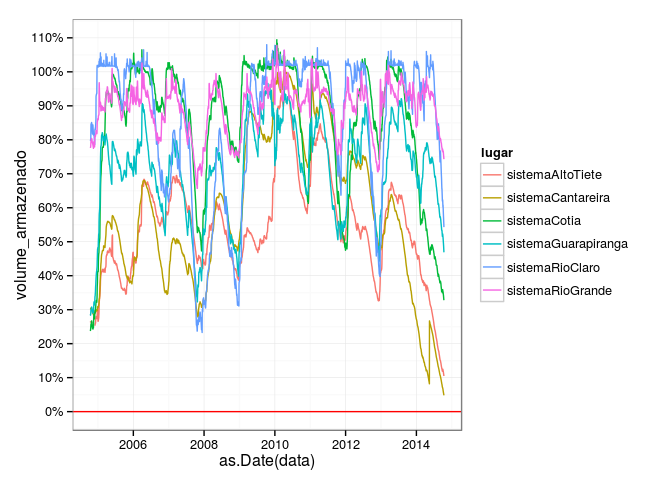

# Sabesp
Julio Trecenti  
12-10-2014  


```r
require(httr)
require(rvest)
require(tidyr)
require(lubridate)
require(dplyr)
require(stringr)
require(ggplot2)
require(scales)
rm_accent <- function (x) gsub("`|\\'", "", iconv(x, to = "ASCII//TRANSLIT"))
renomear <- function(x, ...) {
  names(x) <- eval(substitute(c(...)))
  x
}
```


```r
# baixa_sabesp <- function(x) {
#   link <- 'http://www2.sabesp.com.br/mananciais/DivulgacaoSiteSabesp.aspx'
#   txt <- GET(link)
#   viewstate <- txt %>% content('text') %>% html %>% html_node('#__VIEWSTATE') %>% html_attr('value')
#   eventval <- txt %>% content('text') %>% html %>% html_node('#__EVENTVALIDATION') %>% html_attr('value')
#   data <- as.Date(x)
#   dados <- list(cmbDia=day(data), 
#                 cmbMes=month(data), 
#                 cmbAno=year(data), 
#                 Imagebutton1.x='0', 
#                 Imagebutton1.y='0', 
#                 '__VIEWSTATE'=viewstate, 
#                 '__EVENTVALIDATION'=eventval)
#   r <- POST(link, body=dados, cookies=unlist(txt$cookies))
#   try({
#     nomes <- r %>% content('text') %>% html(encoding='UTF-8') %>% html_nodes('img') %>% html_attr('src')
#     nomes <- nomes %>% `[`(!str_detect(nomes, 'jpg')) %>% str_match('/(.+)\\.gif') %>% `[`(,2) 
#     d <- r %>% 
#       content('text') %>% 
#       html(encoding='UTF-8') %>% 
#       html_node('#tabDados') %>% 
#       html_table(fill=TRUE) %>%
#       renomear('titulo', 'info') %>%
#       select(1:2) %>%
#       filter(titulo!='') %>%
#       mutate(titulo=rm_accent(gsub(' +', '_', titulo)),
#              lugar=rep(nomes, each=4),
#              info=gsub('[^0-9.]', '', gsub(',', '.', info))) %>%
#       spread(titulo, info, convert=TRUE) %>%
#       mutate(volume_armazenado=volume_armazenado/100)
#     return(d)
#   })
#   return(data.frame())
# }
# 
# datas <- today() - days(0:3650)
# d_sabesp <- datas %>% as.character %>% 
#   data.frame(data=., stringsAsFactors=F) %>% 
#   group_by(data) %>% 
#   do(baixa_sabesp(as.character(.))) %>%
#   ungroup
# 
# save(d_sabesp, file='d_sabesp.RData')
```

 
